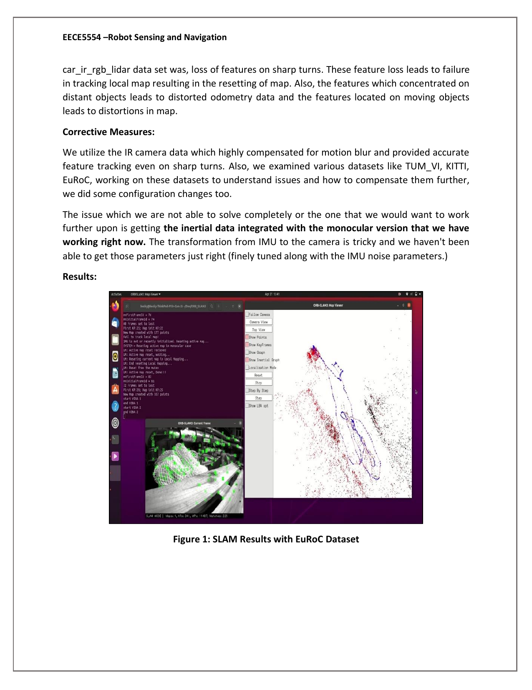
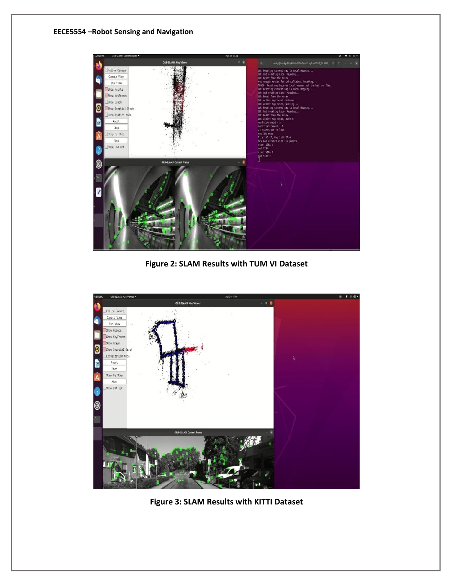
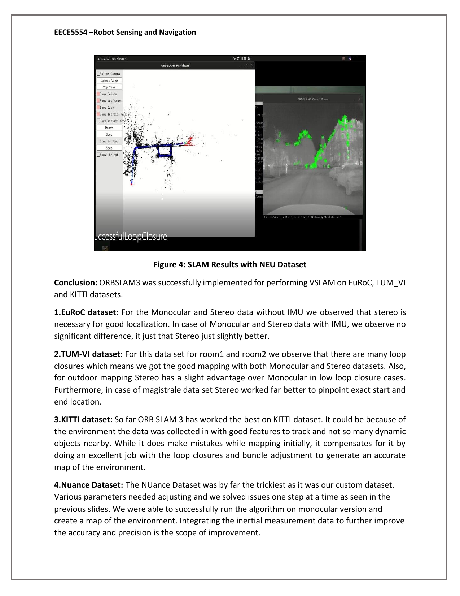

# Visual-Inertial SLAM: ORB-SLAM3 benchmarked across EuRoC, TUM-VI, KITTI, and a custom autonomous-car dataset

A study of how ORB-SLAM3 behaves across four very different visual-inertial datasets, with custom calibration and parameter tuning for Northeastern's NUance autonomous vehicle.

## Why this exists

For my graduate Robot Sensing and Navigation course (EECE5554) at Northeastern, I wanted to understand where state-of-the-art visual-inertial SLAM works, where it falls over, and how much of the gap is calibration vs algorithmic. The answer turned out to be "calibration, mostly," which is exactly the kind of thing that does not come through in a paper.

I took the reference ORB-SLAM3 implementation and ran it in five sensor configurations (monocular, stereo, monocular-inertial, stereo-inertial, plus a custom rig) against four datasets, including data we collected ourselves on Northeastern's NUance autonomous research car.

## Results

ORB-SLAM3 running on the EuRoC MAV dataset, showing the live ORB feature tracks and the reconstructed point cloud / trajectory:



The TUM-VI fisheye runs (top) and KITTI driving sequence (bottom) produced cleaner trajectories thanks to richer feature texture and good loop closures:



The custom NUance car dataset (Newbury Street, Boston), with a successful loop closure on the right:



What I observed across the four datasets (full writeup in `Final_project_report.pdf`):

| Dataset            | Best config           | Notes |
|--------------------|-----------------------|-------|
| EuRoC MAV          | Stereo / Stereo+IMU   | Stereo was necessary for good localization in low-texture areas. Adding IMU gave only marginal improvement. |
| TUM-VI (fisheye)   | Stereo+IMU            | Frequent loop closures in `room1` and `room2`. Stereo pulled ahead on the `magistrale` long-baseline sequence. |
| KITTI Odometry     | Monocular             | ORB-SLAM3 performed best here, helped by static scenes and well-textured roadside features. Bundle adjustment cleanly recovered from early scale drift. |
| NUance (NEU car)   | Monocular (IR camera) | Hardest dataset. IR camera reduced motion blur on sharp turns. Stereo+IMU did not converge with our calibration. |

Real trajectory outputs from the KITTI runs are checked in at `ORB_SLAM3/kitti_monocular_{02,03,05}.txt` in TUM format (`timestamp tx ty tz qx qy qz qw`):

- KITTI seq 02: 2,862 keyframes over 483 s of vehicle motion
- KITTI seq 03: 411 keyframes over 82 s
- KITTI seq 05: 1,319 keyframes over 287 s

Per-dataset map and feature-tracking PDFs (`MH01_mono.pdf`, `MH01_stereoi.pdf`, `kitti_monocular_05.pdf`, etc.) are next to the trajectory files in `ORB_SLAM3/`.

## Quickstart

This repo wraps the upstream [UZ-SLAMLab/ORB_SLAM3](https://github.com/UZ-SLAMLab/ORB_SLAM3) sources with my custom configs and trajectory outputs.

### Build

```bash
# Prereqs (Ubuntu 20.04 / 22.04 tested combo): OpenCV 4.4.0, Eigen 3.3.0,
# Pangolin, C++14 toolchain. Detail in ORB_SLAM3/Dependencies.md.

cd ORB_SLAM3
chmod +x build.sh
./build.sh
```

You also need the ORB vocabulary (~145 MB, not committed):

```bash
# From the upstream repo
cd Vocabulary && tar xf ORBvoc.txt.tar.gz
```

### Run with the EuRoC MAV dataset

```bash
# Stereo + IMU on MH01
./Examples/Stereo-Inertial/stereo_inertial_euroc \
  Vocabulary/ORBvoc.txt \
  Examples/Stereo-Inertial/EuRoC.yaml \
  /path/to/EuRoC/MH01 \
  Examples/Stereo-Inertial/EuRoC_TimeStamps/MH01.txt \
  out_MH01
```

### Run with the NUance custom dataset

The custom calibration files I authored are at the repo root of `ORB_SLAM3/`:

- `custom_params_mono.yaml`: monocular config (640x512, fx=524.89, fy=521.78, etc.)
- `custom_params_s.yaml`: stereo config
- `custom_params_si.yaml`: stereo-inertial config with calibrated IMU noise model (NoiseGyro=1.7e-4, NoiseAcc=2.0e-3) and full `T_b_c1` body-to-camera extrinsics

```bash
# Example: monocular on the NUance rosbag
roscore &
rosrun ORB_SLAM3 Mono Vocabulary/ORBvoc.txt custom_params_mono.yaml &
rosbag play nuance.bag /camera/image_raw:=/camera/image_raw
```

The NUance dataset itself (`car_IR_RGB_lidar`) is a Northeastern course dataset and is not bundled here; the original link is in `Final_project_report.pdf`.

## Approach

ORB-SLAM3 is a feature-based, graph-optimization SLAM system. The pipeline I exercised in each configuration:

1. **Frontend (Tracking).** FAST corners detected per frame, described with the binary ORB descriptor, matched to a local map of 3D points to estimate the current camera pose. CLAHE equalization optional for low-contrast input (used for TUM-VI fisheye).
2. **Local Mapping.** New keyframes trigger triangulation of new map points and a local bundle adjustment over the recent keyframe window.
3. **Loop Closing + Atlas.** DBoW2 bag-of-words queries detect revisits; on a hit, a Sim(3) alignment plus pose-graph optimization closes the loop. The multi-map ("Atlas") system creates a new map when tracking is lost, then merges maps when a place is recognized later.
4. **Inertial Fusion (when IMU available).** A maximum-a-posteriori IMU initialization is run after a short visual bootstrap, then preintegrated IMU measurements are added as factors in the bundle adjustment. This gives scale to the monocular case and robustness through low-texture stretches.

The bulk of my engineering time on the custom dataset went into the parts that papers gloss over:

- **Camera + IMU calibration.** Solving for `fx, fy, cx, cy`, the distortion coefficients `(k1, k2, p1, p2)`, the stereo baseline `T_c1_c2`, and the IMU-to-camera extrinsic `T_b_c1`. Wrong extrinsics show up as the tracker repeatedly losing lock on turns.
- **IMU noise model.** Setting `NoiseGyro`, `NoiseAcc`, `GyroWalk`, `AccWalk` to values that actually reflect the sensor. Defaults from EuRoC do not transfer to a car-mounted IMU running at 200 Hz.
- **Feature extractor tuning.** Lowering `iniThFAST` from 20 to 18 for the NUance monocular config to extract more corners in the low-contrast IR imagery; bumping `nFeatures` to 5000 to give the tracker more to work with on sharp turns.

A persistent issue I documented but did not fully solve: the monocular-inertial run on NUance never converged cleanly. The transformation from IMU to the (forward-looking) IR camera is geometrically tricky on the NUance rig and a small extrinsic error compounds quickly. This is called out as future work in the report.

## Tech stack

- **Languages:** C++ (C++14), Python (eval scripts), shell
- **Core libraries:** OpenCV 4.4, Eigen 3.3, Pangolin (viewer), DBoW2 (place recognition), g2o (graph optimization), Sophus (Lie groups)
- **Middleware:** ROS Melodic for live camera and rosbag input
- **Build:** CMake
- **Datasets:** [EuRoC MAV](http://projects.asl.ethz.ch/datasets/doku.php?id=kmavvisualinertialdatasets), [TUM-VI](https://vision.in.tum.de/data/datasets/visual-inertial-dataset), [KITTI Odometry](http://www.cvlibs.net/datasets/kitti/eval_odometry.php), NUance car (Northeastern, EECE5554)
- **Hardware tested:** Intel RealSense D435i and T265 examples included upstream; NUance car carries stereo RGB, IR, 2x Velodyne VLP-16, IMU, GPS

## Repo layout

```
.
|-- ORB_SLAM3/                       # Upstream UZ-SLAMLab/ORB_SLAM3 (GPLv3)
|   |-- custom_params_mono.yaml      # My monocular config for NUance
|   |-- custom_params_s.yaml         # My stereo config for NUance
|   |-- custom_params_si.yaml        # My stereo-inertial config for NUance
|   |-- kitti_monocular_0[2,3,5].txt # Real trajectory outputs (TUM format)
|   |-- MH01_*.pdf, kitti_*.pdf      # Per-run map / feature plots
|   `-- ...                          # Upstream sources unchanged
|-- docs/figures/                    # Figures extracted for this README
|-- Final_project_report.pdf         # Full writeup
|-- Final Project Presentation.pdf   # Course presentation slides
|-- LICENSE                          # MIT for original work; ORB-SLAM3 stays GPLv3
`-- README.md                        # You are here
```

## Honest scope

This is graduate coursework, not a from-scratch SLAM system. The core algorithm (ORB-SLAM3) is upstream UZ-SLAMLab code; the contribution in this repo is the calibration, parameter tuning, multi-dataset benchmark, and the writeup of what actually breaks when you run a published system on hardware you collected data with yourself. I am keeping it pinned to my portfolio because the comparative analysis and the NUance integration work are still some of the most direct robotics-engineering experience I have published.

## Author

Built by **Dhruvil Parikh** as the final project for Northeastern University's EECE5554 Robot Sensing and Navigation (Spring 2022) during my MS in Robotics. Now a Software Engineer II, Robotics at Globus Medical and founder of [Metrux AI](https://metrux.ai).

- Portfolio: <https://dparikh79.github.io>
- GitHub: [@dparikh79](https://github.com/dparikh79)
